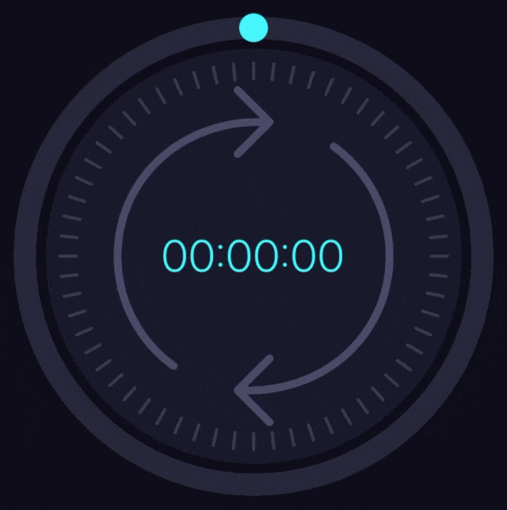

# react-native-rotary-timer

A highly customizable, circular draggable timer component for React Native. Built with `react-native-reanimated`, `react-native-gesture-handler`, and `react-native-svg` for smooth 60 FPS animations and gesture interactions.

## Features

- 🎯 Draggable circular timer with snapping support
- 🎨 Fully customizable ring, ticks, marker, label, hint, and background
- 🔄 Clockwise / counter-clockwise fill
- 📳 Haptic-ready feedback callbacks
- 🏗️ Replaceable sub-components via render injection
- ⏱️ Built-in countdown hook
- 🧩 Imperative ref API for programmatic control

## Demo

Try it in [Expo Snack!](https://snack.expo.dev/@dmytromelnyk/react-native-rotary-timer)



## Installation

```sh
npm install react-native-rotary-timer
# or
yarn add react-native-rotary-timer
```

### Peer Dependencies

Make sure the following packages are installed in your project:

```sh
npm install react-native-gesture-handler react-native-reanimated react-native-svg
```

> [!NOTE]
> Follow the official installation guides for [react-native-gesture-handler](https://docs.swmansion.com/react-native-gesture-handler/docs/2.x/), [react-native-reanimated](https://docs.swmansion.com/react-native-reanimated/docs/fundamentals/getting-started), and [react-native-svg](https://github.com/software-mansion/react-native-svg#installation) if you haven't set them up already.

## Quick Start

```tsx
import RotaryTimer from 'react-native-rotary-timer';

export default function App() {
  return (
    <RotaryTimer
      size={250}
      ringActiveColor="#4CAF50"
      ringInactiveColor="#E0E0E0"
      onChange={(ms) => console.log('Time in ms:', ms)}
    />
  );
}
```

## Props

All props are **optional**. The component works out of the box with sensible defaults.

---

### Common

| Prop | Type | Default | Description |
|------|------|---------|-------------|
| `ref` | `React.Ref<IRotaryTimerRef>` | — | Imperative handle for programmatic control |
| `size` | `number` | `200` | Diameter of the timer in pixels |
| `isEditable` | `boolean` | `true` | Whether the user can drag the timer |
| `initialRotation` | `number` | `0` | Initial rotation angle in radians |
| `minRotation` | `number` | `−Infinity` | Minimum allowed rotation (radians) |
| `maxRotation` | `number` | `+Infinity` | Maximum allowed rotation (radians) |
| `rotationSharedValue` | `SharedValue<number>` | — | External Reanimated shared value to sync with |
| `onChange` | `(ms: number) => void` | — | Called when the rotation changes, with time in ms |
| `onTouchStart` | `(rad: number) => void` | — | Called when the user starts dragging |
| `onTouchEnd` | `(rad: number) => void` | — | Called when the user stops dragging |

---

### Ring

| Prop | Type | Default | Description |
|------|------|---------|-------------|
| `ringWidth` | `number` | `20` | Width of the ring stroke |
| `ringActiveColor` | `string` | `'#f00'` | Color of the filled (active) portion |
| `ringInactiveColor` | `string` | `'#ccc'` | Color of the unfilled (inactive) portion |

---

### Ticks

| Prop | Type | Default | Description |
|------|------|---------|-------------|
| `ticksCount` | `number` | `60` | Number of tick marks around the circle |
| `tickAngle` | `number` | — | Explicit angle between ticks (radians). Overrides `ticksCount` |
| `tickOffsetAngle` | `number` | — | Angular offset for the first tick (radians) |
| `tickHeight` | `number` | `10` | Height of each tick mark |
| `tickWidth` | `number` | `1` | Width of each tick mark |
| `tickColor` | `string` | `'#000'` | Color of the tick marks |
| `tickSpaceFromRing` | `number` | — | Gap between the ring and the ticks |
| `tickRounding` | `number` | — | Border radius of the tick marks |

---

### Snap

Snapping makes the rotation "stick" to the nearest increment.

| Prop | Type | Default | Description |
|------|------|---------|-------------|
| `snapTicksCount` | `number` | `ticksCount` | Number of snap points around the circle |
| `snapAngle` | `number` | — | Explicit angle between snap points (radians). Overrides `snapTicksCount` |
| `snapOffsetAngle` | `number` | — | Angular offset for the snap positions (radians) |

---

### Feedback

Feedback fires a callback at certain angular intervals (e.g. for haptics).

| Prop | Type | Default | Description |
|------|------|---------|-------------|
| `feedbackTicksCount` | `number` | `ticksCount` | Number of feedback points around the circle |
| `feedbackAngle` | `number` | — | Explicit angle between feedback points (radians). Overrides `feedbackTicksCount` |
| `feedbackOffsetAngle` | `number` | — | Angular offset for the feedback positions (radians) |
| `onFeedback` | `() => void` | — | Called each time the user drags past a feedback point |

---

### Marker

The marker indicates the current drag position on the ring.

| Prop | Type | Default | Description |
|------|------|---------|-------------|
| `markerSize` | `number` | `ringWidth` | Diameter of the marker circle |
| `markerColor` | `string` | — | Color of the marker |

---

### Label

The label displays the current time value in the center of the timer.

| Prop | Type | Default    | Description |
|------|------|------------|-------------|
| `labelTextStyle` | `AnimatedStyle<TextStyle>` | —          | Animated text style for the label |
| `labelHideWhenZero` | `boolean` | `true` | Hide the label when the rotation is zero |
| `renderLabel` | `(rad: number) => string` | `HH:MM:SS` | Worklet function that converts radians to a display string |

---

### Hint

The hint is a visual indicator (arrows) shown when the timer is at zero.

| Prop | Type | Default | Description |
|------|------|---------|-------------|
| `hintSize` | `number` | `120` | Size of the hint element |
| `hintColor` | `string` | `'#000'` | Color of the hint |
| `hintHideWhenNotZero` | `boolean` | `true` | Hide the hint when rotation is non-zero |
| `hintEnabledRotation` | `boolean` | `true` | Whether the hint rotates around the center of the timer |

---

### Background

| Prop | Type | Default | Description |
|------|------|---------|-------------|
| `backgroundColor` | `string` | — | Background color of the timer area |
| `backgroundSize` | `number` | `size` | Size of the background circle |
| `backgroundStyle` | `AnimatedStyle<ViewStyle>` | — | Animated style for the background |

---

### Custom Components

You can replace any sub-component with your own implementation.

If you want to replace only the display, use `ComponentView` props; if you also want to change the component's behavior, use `Component` props.

| Prop | Type | Description |
|------|------|-------------|
| `BackgroundComponent` | `React.ComponentType<IBackgroundProps>` | Replaces the background |
| `BackgroundViewComponent` | `React.ComponentType<IBackgroundViewProps>` | Replaces the background view |
| `RingComponent` | `React.ComponentType<IRingProps>` | Replaces the ring |
| `RingViewComponent` | `React.ComponentType<IRingViewProps>` | Replaces the ring view |
| `TicksComponent` | `React.ComponentType<ITicksProps>` | Replaces the ticks container |
| `TickItemComponent` | `React.ComponentType<ITickItemProps>` | Replaces a single tick |
| `TickItemViewComponent` | `React.ComponentType<ITickItemViewProps>` | Replaces a single tick view |
| `MarkerComponent` | `React.ComponentType<IMarkerProps>` | Replaces the marker |
| `MarkerViewComponent` | `React.ComponentType<IMarkerViewProps>` | Replaces the marker view |
| `LabelComponent` | `React.ComponentType<ILabelProps>` | Replaces the label |
| `LabelViewComponent` | `React.ComponentType<ILabelViewProps>` | Replaces the label view |
| `HintComponent` | `React.ComponentType<IHintProps>` | Replaces the hint |
| `HintViewComponent` | `React.ComponentType<IHintViewProps>` | Replaces the hint view |

## Ref Methods

Use a ref to control the timer programmatically:

```tsx
import { useRef } from 'react';
import RotaryTimer, { type IRotaryTimerRef } from 'react-native-rotary-timer';

function App() {
  const timerRef = useRef<IRotaryTimerRef>(null);

  return (
    <>
      <RotaryTimer ref={timerRef} />

      <Button title="Add 5 min" onPress={() => timerRef.current?.increaseRotation(Math.PI / 6)} />
      <Button title="Remove 5 min" onPress={() => timerRef.current?.reduceRotation(Math.PI / 6)} />
      <Button title="Set 30 min" onPress={() => timerRef.current?.setRotation(Math.PI)} />
      <Button title="Reset" onPress={() => timerRef.current?.reset()} />
    </>
  );
}
```

| Method | Signature | Description |
|--------|-----------|-------------|
| `increaseRotation` | `(rotation: number) => void` | Increase rotation by the given radians (animated) |
| `reduceRotation` | `(rotation: number) => void` | Decrease rotation by the given radians (animated) |
| `setRotation` | `(rotation: number) => void` | Set rotation to an absolute value (animated) |
| `reset` | `() => void` | Reset to `initialRotation` (animated) |

## Hooks

### `useCountdown`

Manages a countdown interval that pauses while the user is dragging:

```tsx
import { useCountdown } from 'react-native-rotary-timer';

const { onTouchStart, onTouchEnd } = useCountdown(() => {
  // Return a setInterval that decrements rotation
  return setInterval(() => {
    // increment logic (+ 1 second)
    timerRef.current?.increaseRotation(convertMillisecondsToRadians(1000))
  }, 1000);
}, isActive);
```

## Helpers

The library exports worklet-compatible helper functions:

```tsx
import {
  convertRadiansToMilliseconds,
  convertMillisecondsToRadians,
  convertMillisecondsToTime,
  renderLabel,
} from 'react-native-rotary-timer';

// Convert radians to milliseconds (default: 60 min per full circle)
const ms = convertRadiansToMilliseconds(Math.PI); // → 1,800,000 ms (30 min)

// Convert milliseconds to radians
const rad = convertMillisecondsToRadians(1800000); // → Math.PI

// Break milliseconds into time components. Use it to create your own `renderLabel` function
const time = convertMillisecondsToTime(3661000);
// → { days: 0, hours: 1, totalHours: 1, minutes: 1, totalMinutes: 61, seconds: 1, totalSeconds: 3661, milliseconds: 0 }
```

## Contributing

- [Development workflow](CONTRIBUTING.md#development-workflow)
- [Sending a pull request](CONTRIBUTING.md#sending-a-pull-request)
- [Code of conduct](CODE_OF_CONDUCT.md)

## License

MIT

---